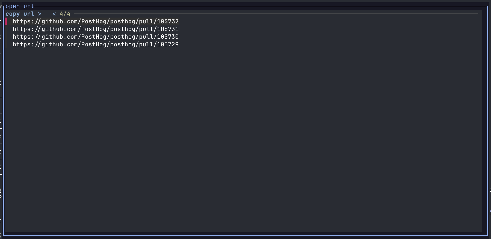

# remote-open-url

A [herdr](https://herdr.dev) plugin that turns the URLs in a pane into something you can act on,
including from a machine that has no browser.



## What it does

Ctrl+click an `http(s)` URL in any pane, or press `prefix+u` to pick one from the focused pane.

Where the herdr server has a browser, the URL opens there. Where it does not, which is the case
for a remote dev box you reach over SSH, the URL is copied to your local clipboard through the
terminal with OSC 52, and a toast confirms it.

## Why

The pickers that already exist read hundreds of lines of history. That makes herdr page an idle
coding agent through its own scrollback, so the pane visibly scrolls while you are only looking
for a link. This plugin reads only as many rows as the pane shows, with soft-wrapped lines joined,
so a URL longer than the pane width comes back whole and a full-screen agent such as Codex never
scrolls. It scans deeper only when you ask for it.

None of them handle a host without a browser either. Here the URL reaches your clipboard instead
of failing silently.

## Install

```sh
herdr plugin install tatoalo/herdr-remote-open-url
```

Requirements: herdr 0.9+, `bash`, `python3`. `fzf` is optional and gives you a fuzzy list instead
of a numbered one.

Bind the picker in `~/.config/herdr/config.toml`:

```toml
[[keys.command]]
key = "prefix+u"
type = "plugin_action"
command = "remote-open-url.pick"
description = "open a URL from this pane"
```

Then reload:

```sh
herdr server reload-config
```

Ctrl+click needs no binding. It works as soon as the plugin is installed.

Plugin actions run on the server that owns the pane, so a remote machine needs the plugin
installed there too.

## Configuration

Optional. Copy `.env.example` to `$(herdr plugin config-dir remote-open-url)/.env`:

| Setting | Default | Meaning |
|---|---|---|
| `REMOTE_OPEN_URL_MODE` | `auto` | `open` always opens a browser, `copy` always copies, `auto` decides per host |
| `REMOTE_OPEN_URL_LINES` | unset | How deep to scan when the screen and recent output hold no URL. This is the read that pages an idle agent. |

## Development

```sh
herdr plugin link ./herdr-remote-open-url
herdr plugin action list --plugin remote-open-url
```

To release, bump `version` in `herdr-plugin.toml`. When that change lands on `main`, the release
workflow tags `v<version>` and publishes a GitHub release.

## License

MIT
